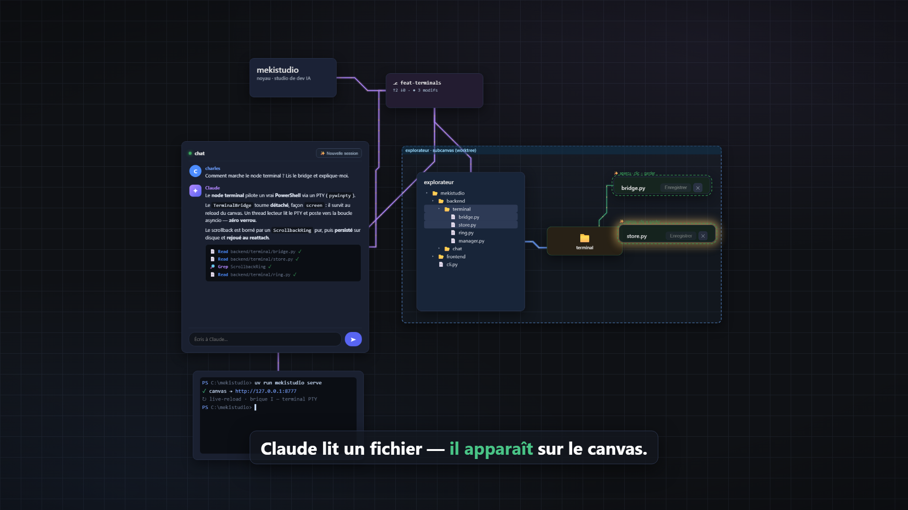
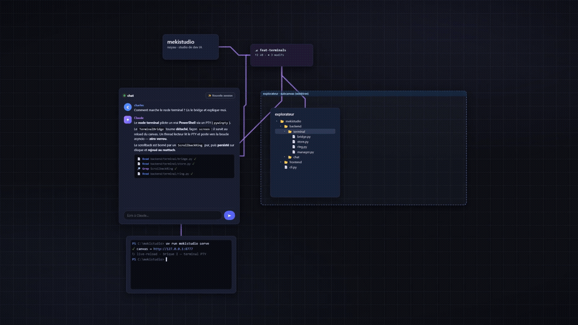

# mekistudio

**Un studio de développement piloté par l'IA, où chaque action prend une forme
visible sur un canvas infini.** Pur Python, sans Docker, auto-hébergé : un seul
repo qui se met à jour lui-même via `mekistudio update`.

## Aperçu

[](https://www.youtube.com/watch?v=_rOJqARkk9o)

> ▶ **[Voir le trailer (≈ 1 min 29, muet)](https://www.youtube.com/watch?v=_rOJqARkk9o)**



Trailer généré **automatiquement** dans le langage visuel du produit (HTML
déterministe réutilisant `canvas.css` + Playwright + ffmpeg, muet) — sources et
pipeline dans [`trailer/`](trailer/) (`python trailer/build.py`).

---

## C'est quoi, en une phrase ?

Imaginez un **plan de travail infini** (comme une carte mentale ou un tableau
Figma) sur lequel vivent des **briques** : un chat avec une IA, un explorateur de
fichiers, des éditeurs de code, un terminal, l'état de votre dépôt git. Vous
discutez avec l'IA (Claude) ; **chaque fois qu'elle agit — lire un fichier,
fouiller un dossier, lancer une commande — l'action devient visible** : le
fichier concerné *apparaît* sur le canvas, une **comète** file le long du câble
qui relie les briques, et la brique cible s'illumine.

Là où un IDE classique cache ce que fait l'agent derrière une fenêtre de chat,
mekistudio **le donne à voir** : on regarde l'IA penser et toucher le code, en
temps réel, comme un réseau de neurones qui s'allume.

## La vision

- **Un seul repo, auto-hébergé.** Tout vit dans `C:\mekistudio`. On l'installe en
  mode *editable* : le code est lu **en direct** depuis le dépôt. Pas de build,
  pas d'exe à réécrire, pas de conteneur.
- **Le studio se met à jour lui-même.** `mekistudio update` fait un `git pull` et
  le code est immédiatement actif ; `mekistudio update --restart` arrête
  l'instance, met à jour, et relance une instance fraîche.
- **L'objectif à terme : importer mekistudio dans lui-même** et le laisser
  **s'améliorer** — un studio de dev IA qui développe le studio de dev IA.
- **On reconstruit petit à petit.** Le projet réimplémente proprement les
  concepts des anciennes versions (documentés dans [`docs/old/`](docs/old/)),
  **sans en reprendre le code**. Chaque brique : spec → plan → TDD → revue → merge.

## Comment ça marche : le canvas

Tout est une **node** (une brique) posée sur un canvas infini qu'on déplace et
zoome librement. Les nodes sont reliées par des **câbles** au tracé « métro »
(segments à 45°, regroupés en rubans néon) qui matérialisent **qui parle à qui**.

La topologie de base ressemble à un arbre vivant :

```
kernel ─ git ─┬─ chat (Claude)
              ├─ terminal (PowerShell)
              └─ subcanvas ─ explorateur de fichiers ─ dossiers ─ éditeurs
```

Quelques idées-clés pour comprendre l'esprit :

- **Placement organique automatique.** Les nodes ne se chevauchent jamais : un
  algorithme les range en **arbre radial** (l'explorateur au centre, les dossiers
  poussent en rayons vers l'extérieur, les fichiers en anneau autour de leur
  dossier) et garantit un vide entre les zones — façon « neurones » qui poussent.
  Quand on déplace une brique, les voisines **s'écartent en douceur** au lieu de
  se recouvrir.
- **Les impulsions.** Quand Claude lit un fichier ou fouille un dossier, une
  **comète** parcourt le câble jusqu'à la brique concernée, qui s'illumine. En fin
  de tour, le chat garde une lueur jusqu'à ce qu'on clique. C'est le « ça pense »
  rendu visible.
- **Rien n'est figé inutilement.** Les câbles ne sont **pas stockés** : ils sont
  *dérivés* de la hiérarchie des nodes (chaque node connaît son parent). Idem pour
  les bornes du `subcanvas`, recalculées à partir de ce qu'il contient. Moins
  d'état persisté = moins de divergences.

## Ce qui marche aujourd'hui (features livrées)

| Brique | Ce que ça fait |
|---|---|
| **Canvas infini** | Pan / zoom, auto-fit (« tout voir »), placement organique sans chevauchement, câbles néon dérivés, anti-jitter. |
| **Node chat × Claude** | Vraie session **Claude Agent SDK** en streaming token-par-token, bulles façon Discord. Session **détachée** (survit au rechargement de la page : on se ré-attache et le flux rejoue). Stop, file d'attente, nouvelle session. |
| **Outils lecture seule** | Claude utilise **Read / Glob / Grep / LS**, **confinés au dépôt** par un garde durci (il ne peut rien lire en dehors). Chaque appel d'outil = une **tool-card** (icône, état ⟳/✓/✗/🚫, sortie dépliable). |
| **Hooks → impulsions** | Les hooks de Claude Code déclenchent les comètes/lueurs ; lire un fichier non ouvert le **matérialise** automatiquement à l'écran (éditeur éphémère, épinglable d'un clic). |
| **Node explorateur** | Arbre de fichiers façon VSCode, dépliage **paresseux**, sandboxé au dépôt, exclusions configurables. |
| **Node éditeur** | Éditeur **CodeMirror 6** (coloration, word-wrap), lecture/édition/sauvegarde atomique, multi-instances, double-clic pour ouvrir. |
| **Dossiers en nodes** | Ouvrir un fichier matérialise la **chaîne de dossiers** de son chemin (un node par segment, ou compactée façon VSCode), chacun étant un mini-explorateur réductible. |
| **Node subcanvas** | Un **cadre réductible** qui confine tout le monde de l'explorateur ; ses bornes épousent automatiquement son contenu. |
| **Node terminal** | **PowerShell interactif** (vrai PTY via `pywinpty`) rendu avec **xterm.js** : on tape des commandes, lance un build/serveur, voit les logs en direct, couleurs ANSI, resize. Détaché et persistant comme le chat. |
| **Node git** | État de la branche en lecture seule (`⎇ branche · ↑ahead ↓behind · ● modifs`), rafraîchi en fin de tour, réductible. |
| **CLI auto-hébergée** | `serve` · `update` (code live) · `update --restart` (stop + pull + relance), bootstrap `.mekistudio/`. |

> Détail brique par brique (A → I) dans [`docs/ROADMAP.md`](docs/ROADMAP.md) ;
> archi réelle du code dans [`docs/ARCHITECTURE.md`](docs/ARCHITECTURE.md).

## Démarrer

```bash
uv sync --extra dev
uv run mekistudio serve        # ouvre http://127.0.0.1:8777/
```

`mekistudio serve` crée `.mekistudio/` dans le repo courant s'il n'existe pas,
puis ouvre le canvas principal.

## Installer en global (commande `mekistudio` sur le PATH)

```bash
uv tool install --editable --force .   # depuis la racine du repo
mekistudio serve                       # lançable de n'importe où
```

L'install **editable** fait pointer l'outil global vers ce repo : le code est
lu en direct. Éditer la source (ou `git pull`) est pris en compte au prochain
`mekistudio serve` — aucun rebuild, aucun exe à réécrire.

## Se mettre à jour

```bash
mekistudio update              # git pull la source (le code editable est live)
mekistudio update --restart    # arrête l'instance en cours, pull, relance serve
```

`--restart` arrête le `serve` en cours (via `.mekistudio/serve.pid`), fait le
`git pull`, puis relance un `serve` **frais** en avant-plan (il réimporte le
code à jour). `--port` choisit le port relancé (défaut 8777).

Si les **dépendances** (`pyproject.toml`) ont changé, relance, studio arrêté :
`uv tool install --editable --force .`

## Architecture en bref

```
backend/  (état, modèles, FS — n'importe JAMAIS frontend/)
   ↑
frontend/ (FastAPI + Jinja + Alpine.js, géométries pures testées)
   ↑
cli.py    (seul câblage : serve / update)
```

Stack : **uv · Typer · FastAPI/uvicorn · Jinja2 · Alpine.js · Pydantic v2 ·
Claude Agent SDK · pytest**. Les briques visuelles (câbles, collision, layout
radial, dossiers, subcanvas…) sont des modules JS **purs** testés hors DOM
(`node --test`), assemblés par `canvas.js`. Détails complets :
[`docs/ARCHITECTURE.md`](docs/ARCHITECTURE.md).

## Roadmap — la suite

Prochaines briques envisagées (cf. [`docs/ROADMAP.md`](docs/ROADMAP.md) et
[`docs/IDEAS.md`](docs/IDEAS.md)) :

- ✍️ **Outils en écriture pour Claude** : `Write` / `Edit` / `Bash`, avec une
  **isolation par session** (conteneur Docker dédié : clone → l'IA travaille
  isolée → merge-back). C'est la grande brique « sandbox » mise de côté pour
  l'instant.
- ❓ **QCM / `ask_user`** : permettre à Claude de poser une question à choix au
  milieu d'un tour (la lueur d'attente du chat est déjà prête à l'accueillir).
- 🌿 **Worktrees git par branche** : un état isolé par branche, à terme **un
  subcanvas par worktree** (mondes imbriqués).
- 📦 **Conteneurisation & multi-repos** : plusieurs dépôts dans un même studio,
  derrière un **proxy mono-port** maison (pur Python, pas de Caddy).
- 🖥️ **Terminal** : spawn multi à la demande, clear/restart, multi-shell,
  terminal *worktree-aware*.
- 🧩 **Confort du canvas** : palette d'ajout de nodes, multi-onglets.
- 📝 **Éditeurs dérivés** : Markdown + preview, **diff du fichier vs HEAD**,
  comparaison côte à côte de deux implémentations.
- 🪞 **Le cap ultime** : importer mekistudio dans mekistudio, et le laisser
  s'améliorer lui-même.

## Tests

```bash
uv run pytest
```

## Docs

- [`docs/ROADMAP.md`](docs/ROADMAP.md) — où on en est + ce qui reste (à lire en premier).
- [`docs/ARCHITECTURE.md`](docs/ARCHITECTURE.md) — l'archi réelle du code (modules, API, front, invariants).
- [`docs/IDEAS.md`](docs/IDEAS.md) — boîte à idées (features futures).
- [`docs/old/`](docs/old/) — concepts des anciennes versions (vision, pas de code).
- [`docs/superpowers/`](docs/superpowers/) — specs & plans détaillés.
